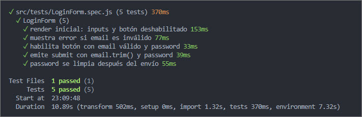

# Pruebas-Vue
Ejercicio4 - Módulo VII - Vue

ejercicio desplegado: https://ramirezjm.github.io/Pruebas-Vue/

[](https://choosealicense.com/licenses/mit/)


Se aplica TDD para construir y probar un componente de formulario sencillo usando Vue Test Utils y un runner de unit tests con Vitest.

1. Se tiene un componente LoginForm.vue con dos campos, nombre y email:
<div>
  
</div>

- Si se ingresa un email con formato no válido o el password está vacío, muestra un mensaje de error:
<div>
  
</div>

- Si el email tiene formato válido y el password no se encuentra vacío, el botón 'Ingresar' se habilita:
<div>
  
</div>

- Al hacer un envío válido de LoginForm se emite un submit con `{ email: email.trim(), password }` y el password queda vacío luego del envío. Además todos los tests fueron aprobados:
<div>
  
</div> 

#### Comportamientos probados
Se probaron varios comportamientos del componente LoginForm:
- Primero, el render inicial, verificando que los inputs de email y password existen y que el botón “Ingresar” aparece deshabilitado.
```Javascript
const wrapper = mount(LoginForm)

expect(wrapper.get('[data-testid="email"]').exists()).toBe(true)
expect(wrapper.get('[data-testid="password"]').exists()).toBe(true)

const button = wrapper.get('[data-testid="submit"]')
expect(button.attributes('disabled')).toBeDefined()
```

- Luego se comprobó la validación del formulario, asegurando que el botón solo se habilita cuando el email tiene un formato válido y el password no está vacío.
```Javascript
await wrapper.get('[data-testid="email"]').setValue('test@mail.com')
await wrapper.get('[data-testid="password"]').setValue('123456')

const button = wrapper.get('[data-testid="submit"]')
expect(button.attributes('disabled')).toBeUndefined()
```

- También se verificó que, si el email es inválido, se muestra un mensaje de error visible para el usuario.
```Javascript
await wrapper.get('[data-testid="email"]').setValue('correo-invalido')

const error = wrapper.get('[data-testid="error"]')
expect(error.text()).toContain('Email inválido')
```

- Finalmente, se probó que al enviar el formulario se emite el evento submit con el payload `{ email: email.trim(), password }` y que el campo password se limpia después del envío.
```Javascript
await wrapper.get('form').trigger('submit.prevent')

const emitted = wrapper.emitted('submit')

expect(emitted[0][0]).toEqual({
  email: 'test@mail.com',
  password: '123456'
})

const password = wrapper.get('[data-testid="password"]')

expect(password.element.value).toBe('')
```

#### Uso de Vue Test Utils
- Se utilizó Vue Test Utils para montar el componente mediante mount, lo que permite renderizarlo en un entorno de pruebas.
```Javascript
import { mount } from '@vue/test-utils'
import LoginForm from '../components/LoginForm.vue'

const wrapper = mount(LoginForm)
```

- Se empleó setValue para simular la entrada de datos del usuario en los inputs, trigger para simular el envío del formulario y emitted para verificar que el componente emitió correctamente el evento submit.
```Javascript
await wrapper.get('[data-testid="email"]').setValue('test@mail.com')
await wrapper.get('form').trigger('submit.prevent')

const emitted = wrapper.emitted('submit')
expect(emitted).toBeTruthy()
```
Las pruebas se centraron en contratos observables (lo que el usuario ve o los eventos que el componente emite) en lugar de detalles internos, porque esto hace que los tests sean más robustos y menos dependientes de la implementación interna del componente.

#### Uso de mocks o stubs
En este ejercicio no fue necesario aplicar mocks o stubs, ya que el componente no dependía de APIs, router ni componentes hijos. Todo el comportamiento estaba contenido dentro del propio LoginForm. Sin embargo, el uso de mocks o stubs sería útil si existieran dependencias externas o helpers de validación, ya que permitiría aislar la unidad bajo prueba, manteniendo los tests rápidos, deterministas y enfocados únicamente en el comportamiento del componente.


### Clonar el repositorio

  ```bash
   git clone https://github.com/RamirezJM/Pruebas-Vue.git
   cd Pruebas-Vue
  ```

### Instalar dependencias

```bash
npm install
```

### Ejecutar tests

```bash
npm run test:unit
```

### Levantar el servidor

```bash
npm run dev
```
