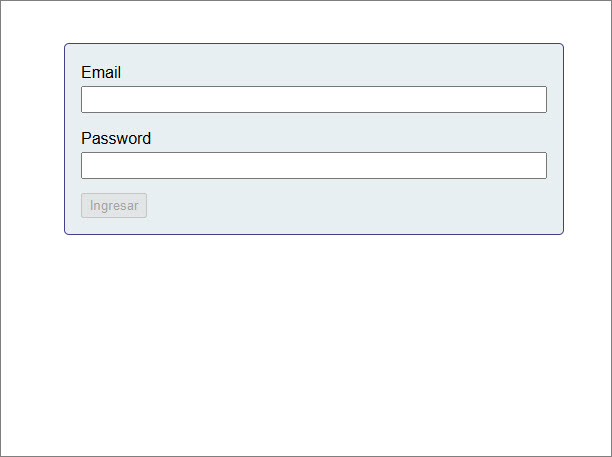
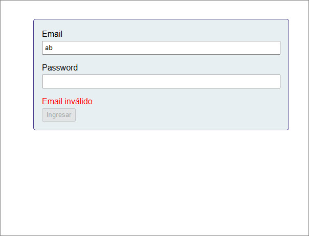
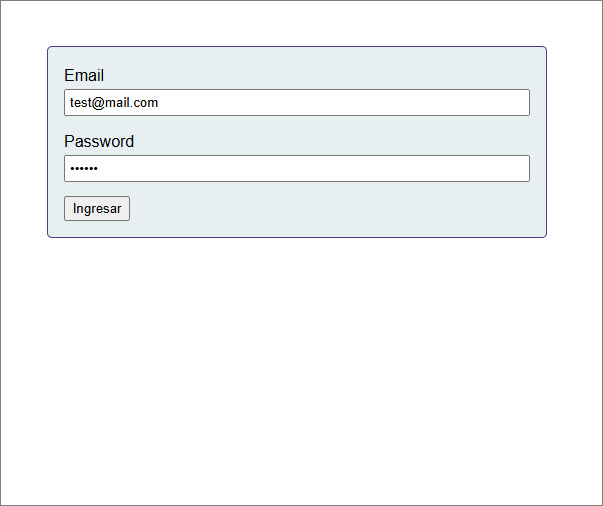

# Pruebas-Vue
Ejercicio4 - Módulo VII - Vue

ejercicio desplegado: https://ramirezjm.github.io/Pruebas-Vue/

Se aplica TDD para construir y probar un componente de formulario sencillo usando Vue Test Utils y un runner de unit tests con Vitest.

1. Se tiene un componente LoginForm.vue con dos campos, nombre y email:

  

- Si se ingresa un email con formato no válido o el password está vacío, muestra un mensaje de error:

  

- Si el email tiene formato válido y el password no se encuentra vacío, el botón 'ingresar' se habilita:

  

